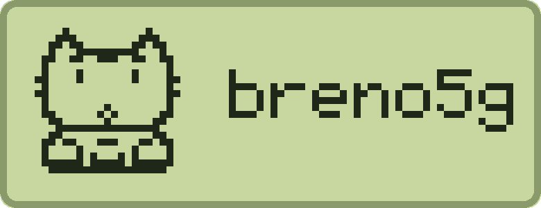

  <picture>
    <source media="(prefers-color-scheme: dark)" srcset="./assets/banner-dark.svg">
    <source media="(prefers-color-scheme: light)" srcset="./assets/banner-light.svg">
    
  </picture>

Full-stack developer · Go, TypeScript, and whatever the problem asks for

---

I build small tools for problems I actually have: manga downloaders, a CHIP-8
emulator, a terminal pet that talks to my scripts, a declarative setup for my
machines. Most of them exist because doing it by hand annoyed me one time too many.

Right now I'm writing a 2D physics engine in C++ and finding out what lives below
the garbage collector.

### Selected work

<table>
<tr>
<td width="50%" valign="top">

**[tama](https://github.com/breno5g/tama)** · Rust 
Terminal tamagotchi that doubles as your assistant's face — a pixel-art pet that
speaks messages sent by other programs. The cat above comes straight from its
sprite data.

</td>
<td width="50%" valign="top">

**[emugo-8](https://github.com/breno5g/emugo-8)** · Go 
CHIP-8 emulator built on SDL2 — opcode decoding, display, timers and input.

</td>
</tr>
<tr>
<td width="50%" valign="top">

**[rinha-backend-2026](https://github.com/breno5g/rinha-backend-2026)** · Go 
Fraud detection with vector search. Third year running in the challenge.

</td>
<td width="50%" valign="top">

**[workstation](https://github.com/breno5g/workstation)** · Ansible 
One YAML file sets up a whole machine on Arch, Debian or Fedora.

</td>
</tr>
</table>

### Stack

`Go` · `TypeScript` · `Node` · `React / React Native` · `Rust` · `C++` · `Lua` 
`Postgres` · `SQLite` · `Docker` · `Linux` · `Ansible` · `Neovim`

### Elsewhere

[Blog](https://blog.breno5g.dev) · [LinkedIn](https://www.linkedin.com/in/breno5g/)

Games, books, manga, and an unreasonable amount of time spent on dotfiles.
